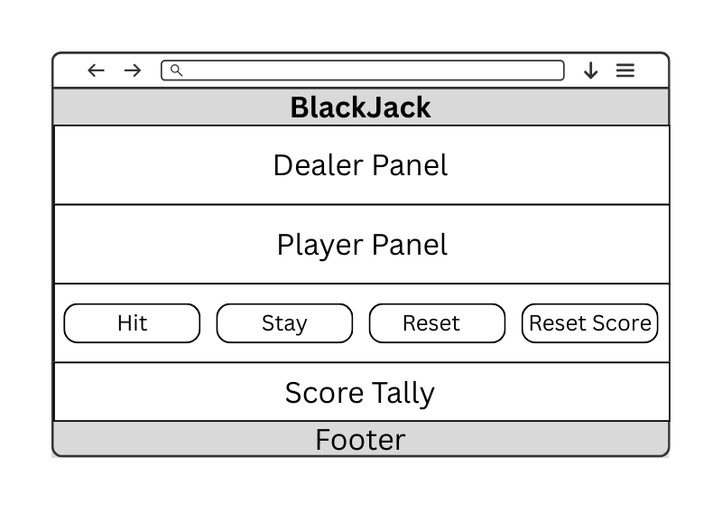
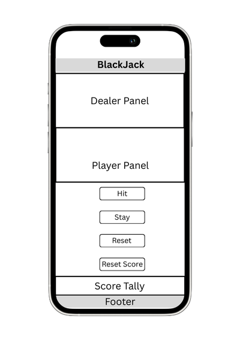
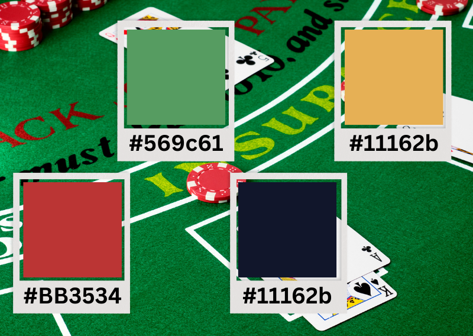
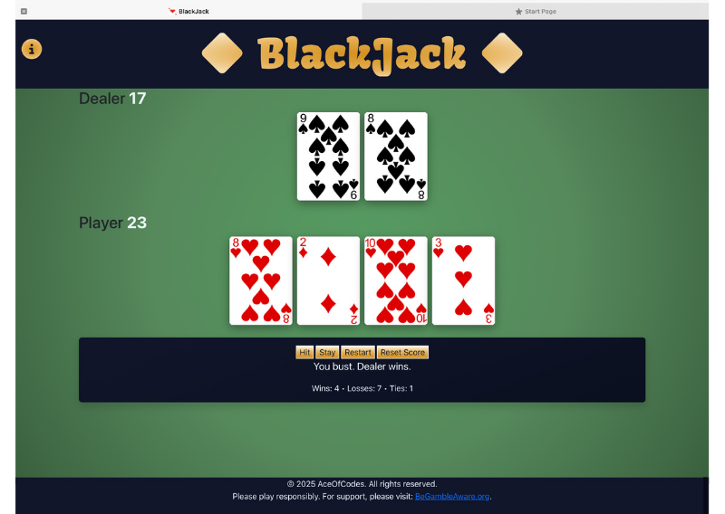
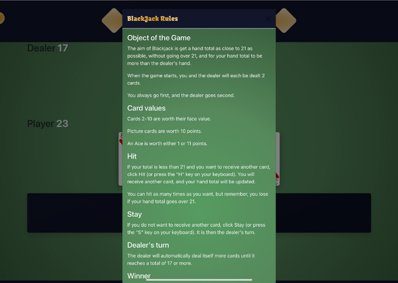

# AceOfCodeReturns
We thought it would be fun to take a classic card game and build the game in browser for a Hackathon project. Blackjack was the perfect choice since it’s simple to learn, quick to play, and a great way to practice building something interactive. Our site lets you play against a dealer, hit or stand, reset score and see the outcome right away, just like at the table but in your browser.


[Here](https://ui.dev/amiresponsive?url=https://davidblue90125.github.io/AceOfCodeReturns/) is a link to the site showcased on different screensizes using amiresponsive!

Find the link to the deployed site [here](https://davidblue90125.github.io/AceOfCodeReturns/)

---

## TABLE OF CONTENTS:
1. [Design & Planning](#design--planning)
    * [User Stories](#user-stories)
    * [Wireframes](#wireframes)
    * [Typography](#typography)
    * [Colour Scheme](#colour-scheme)
    
2. [Features](#features)
    * [Navigation](#navigation)
    * [Footer](#footer)
    * [Other features](#other-features)
    * [Future Implementations](#future-implementations)
    * [Accessibility](#accessibility)

3. [Technologies Used](#technologies-used)
  * [Languages Used](#languages-used)
  * [Frameworks, Libraries & Programs Used](#frameworks-libraries--programs-used)

4. [Testing](#testing)

5. [Bugs](#bugs)

6. [Deployment](#deployment)
* [Local Development](#local-development)

7. [Credits](#credits)
   * [Code Used](#code-used)
   * [Content](#content)
   * [Media](#media)
   * [Acknowledgments](#acknowledgments)

   


## DESIGN & PLANNING:

### User Stories

#### Must Have

- **Stay button functionality:**  
  As a player, I want to Stay to stop drawing and let the dealer reveal and resolve the round.
- **Immediate round outcome feedback (win/lose/tie) and updated totals:**  
  As a player, I want immediate round outcome feedback (win/lose/tie) and updated totals.
- **Responsiveness on all device sizes:**  
  As a player, I want responsive cards and panels so the UI fits any screen.
- **Clear game layout:**  
  As a player, I want a clear game layout so that I can see dealer and player areas separately.
- **Display default dealer cards when game starts:**  
  As a player, I want to start a round with one hidden dealer card and two visible player cards.
- **Hit button functionality:**  
  As a player, I want to Hit to draw a new card while I haven’t busted.
- **Rules of the game:**  
  As a new player, I want to click on a Rules button so that I can learn how to play the game.
- **Resetting the game:**  
  As a player, I need clear controls including Reset so I can start a new round anytime.

#### Should Have

- **Consistent and readable interface:**  
  As a sighted user, I want polished visuals so the interface is readable and consistent.
- **Keyboard accessibility:**  
  As a player, I want keyboard accessibility to play without a mouse.

#### Could Have

- **Auto-refresh of deck:**  
  As a player, I want the so I can keep playing long sessions.
- **Wins/Losses/Ties scoreboard:**  
  As a player, I want the Wins/Losses/Ties scoreboard to persist across page reloads and be manually resettable.
- **404 error page:**  
  As a site owner, I want a 404 error page to be displayed in the event of a 404 error.
- **Favicon:**  
  As a player, I want a site favicon so the game looks polished in the browser tab.

### WIREFRAMES

 

 

### TYPOGRAPHY
#### Tools used:

* Google Fonts
* Font Joy

Fonts used for this project:

* Kavoon (serif)- for H1 headings
* Quando (serif) - Subheadings and Buttons
* Hind Madurai (serif) - Paragraphs

These fonts were chosen to a fun vibe to reflect the game of BlackJack. Fonts were chosen using [fontjoy](https://fontjoy.com/#) and imported via [Google Fonts](https://fonts.google.com/selection/embed)

Here is an image of the fonts chosen as a reference.

### COLOUR SCHEME

  

Colour palettte created using [Coolors](https://coolors.co/)
A color scheme was chosen to reflect a physical BlackJack environment:  
Green - from the felt of the playing area    
Gold - for money / tokens used in play  
Black - from the playing cards  
Red - from the playing cards  

## FEATURES:

### FOOTER

Footer contains copyright information and an external link to a gamble support website.

### OTHER FEATURES

 

1. Favicon of card image

2. Information icon - clicks to open modal

3. Header with title

4. Dealer area with cards

5. Dealer running score

6. Player area with cards

7. Player running score

8. Control buttons

9. Game status message

10. Score tally

11. Footer with copyright information

12. Link of footer to gamble support website that opens on another page

13. 404 error message

14. Modal with information on how to play game

  

### FUTURE IMPLEMENTATIONS

1. Adding SPLIT functionality to the game

2. Improvement - when player goes bust, dealer wins automatically without pulling more cards


### ACCESSIBILITY
Accessibility has been a key consideration throughout the development of this project. The following measures were taken to ensure the site is usable by as many people as possible:

- **Semantic HTML:** All content is structured using semantic HTML elements (e.g., `<header>`, `<main>`, `<section>`, `<footer>`, `<nav>`, `<button>`, `<h1>`-`<h4>`, `<p>`, etc.) to provide clear meaning and improve navigation for screen readers.
- **Descriptive Alt Text:** All images include descriptive `alt` attributes so users with screen readers can understand the content and purpose of each image.
- **Accessible Icons:** Icons used for actions (such as the information icon) include `aria-label` attributes to provide context for screen readers.
- **Keyboard Navigation:** All interactive elements (buttons, links, modal dialogs) are accessible via keyboard navigation, ensuring users can play the game without a mouse.
- **Color Contrast:** The color palette was chosen to provide sufficient contrast between text and background, meeting WCAG AA standards for readability.
- **Accessible Fonts:** Fonts were selected for clarity and readability, including dyslexia-friendly sans-serif and serif options.
- **Visible Focus States:** Default browser focus outlines are preserved to help keyboard users see which element is active.
- **Responsive Design:** The layout adapts to all screen sizes, ensuring accessibility on mobile, tablet, and desktop devices.
- **ARIA Live Regions:** Game status and score updates use `aria-live` attributes to announce changes to assistive technologies in real time.
- **External Links:** External links (such as the gamble support website) open in a new tab and use `rel="noopener noreferrer"` for security and clarity.

These practices help ensure the site is inclusive and usable for all players, regardless of ability or device.


## TECHNOLOGIES USED

### LANGUAGES USED
HTML
CSS
JavaScript

### FRAMEWORKS, LIBRARIES & PROGRAMS USED
Bootstrap
favicon.io  
Canva  
GitHub project boards  
GitHub version control   
Font Awesome  
HTML5  
CSS  
JavaScript  
VS Code  
Font Joy
Coolors


## TESTING

### Google's Lighthouse Performance

#### Mobile Results


The performance issues for mobile stem from large image files

Insights:
* Improve image delivery Est savings of 1,284 KiB
* Use efficient cache lifetimes Est savings of 1,197 KiB
* Render blocking requests Est savings of 900 ms
* Font display Est savings of 30 ms

Diagnostics
* Minify JavaScript Est savings of 4 KiB
* Reduce unused CSS Est savings of 45 KiB

#### Desktop Results


The Desktop site passed all the performance tests 

Insights
* Render blocking requests Est savings of 550 ms
* Use efficient cache lifetimes Est savings of 1,012 KiB
* Improve image delivery Est savings of 1,075 KiB
* Font display Est savings of 40 ms

Diagnostics
* Minify JavaScript Est savings of 4 KiB
* Avoid serving legacy JavaScript to modern browsers Est savings of 0 KiB


### Browser Compatibility
Browser compatability with all the main browsers tested using powermapper.


No browser compatability issues

### Responsiveness

#### Mobile S 320px


#### Tablet 768px 


#### Laptop L 1440px


### Code Validation

#### W3 HTML Validator:

W3 Validation carried out and errors were identified.

 A `<div>` in one of the sections was not closed, causing these errors, once this bug was fixed the warnings resolved. 


#### CSS Jigsaw Validator:
No Errors found using the W3C CSS validation tool 


## BUGS
### Header and Footer Styling Issues
- Fixed in commit c653c01 and cd963d8
- Refactored header and footer styles for better accessibility and visual consistency.

### Dealer and Player Area Layout
- Fixed in commit fc3ef4f and f751fc5
- Removed unnecessary Bootstrap grid classes and centered player cards for improved layout.

### Tally Text Color Visibility
- Fixed in commit 067ddf6
- Updated tally text color to aliceblue for better contrast and readability.

### Dealer Score Display
- Fixed in commit 6de0482
- Added code to display the dealer's score correctly.

### Game Button Functionality
- Fixed in commit 5ae04b4
- Amended hit button code so that only one card is dealt per click.

### Unclosed `<div>` in Game Buttons Section
- Closed an unclosed `<div>` in the game buttons section of index.html to resolve HTML validation errors and prevent layout issues.


## DEPLOYMENT
### Creating Repository on GitHub
The repository was created on GitHub using the following method:
- Go to the [home](https://github.com/dashboard) section on GitHub.
- Click on + in the top right corner and select new repository from the drop-down. 
- Enter a name for the repository and click Create repository.

### Deloying on Github
The site was deployed to Github Pages using the following method:
- Go to the Github repository.
- Navigate to the 'settings' tab.
- Using the 'select branch' dropdown menu, choose 'main'.
- Click 'save'.

### LOCAL DEVELOPMENT
To make a copy of this project and run it locally:
- Go to the [GitHub repository](https://github.com/davidblue90125/AceOfCodeReturns).
- Click the green **Code** button and select **Download ZIP** to download the project files, or copy the URL under **Clone** to use with Git.
- If using Git, open your terminal and run:
  ```
  git clone https://github.com/davidblue90125/AceOfCodeReturns.git
  ```
- Navigate into the project directory:
  ```
  cd AceOfCodeReturns
  ```
- Open the `index.html` file in your browser to play the game locally.

No additional setup is required for basic play. If you want to make changes, you can edit the files in your favorite code editor (such as VS Code).

## CREDITS

YouTube video tutorial: https://www.youtube.com/watch?v=bMYCWccL-3U  
Card images: https://github.com/ImKennyYip/black-jack

### CODE USED
If you have used some code in your project that you didn't write, this is the place to make note of it. Credit the author of the code and if possible a link to where you found the code. You could also add in a brief description of what the code does, or what you are using it for here.
  - Code & Text Content
### CONTENT
Who wrote the content for the website? Was it yourself - or have you made the site for someone and they specified what the site was to say? This is the best place to put this information.
### MEDIA
  - Media
  If you have used any media on your site (images, audio, video etc) you can credit them here. I like to link back to the source where I found the media, and include where on the site the image is used.
### ACKNOWLEDGMENTS  
  - Acknowledgment
  If someone helped you out during your project, you can acknowledge them here! For example someone may have taken the time to help you on slack with a problem. Pop a little thank you here with a note of what they helped you with (I like to try and link back to their GitHub or Linked In account too). This is also a great place to thank your mentor and tutor support if you used them.

